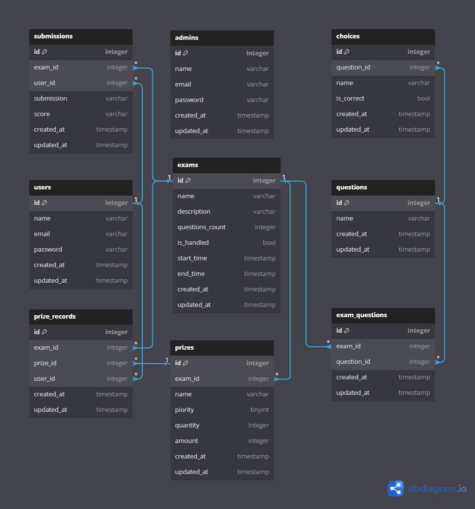
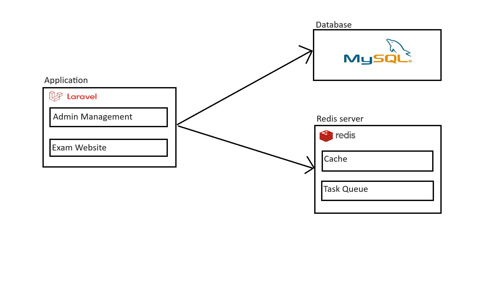

# Exam Managment System

## Project Description
The "Exam Management System" is a system for managing competitions for students, involving two main roles: Admin and User. Admins create and manage competitions, questions, and prizes. Users log in, register for competitions, and take exams.

1. Entity Relationship Diagram (ERD)



- admin: Stores information about admins. Currently, the system does not allow for the creation of additional admins and will use admin accounts created by Seeder.
- user: Stores information about students.
- exam: Stores information about the exams, including question_count for the number of questions in the exam, and is_handled to indicate whether the exam results have been processed.
- question: Stores information about the question content.
- choice: Stores information about the answers for a question. Each question has multiple answers, and the is_correct field in the choice indicates whether the answer is correct.
- exam_question: Related to both exam and question, it stores information about the questions included in an exam.
- submission: Stores information about the students' submissions.
- prize: Stores information about the prize structure for the competition, with priority used to sort the order of prizes.
- prize_record: Stores information about the prize winners.

2. System Diagram



The system consists of three components:

- Application built with Laravel: This can be divided into two parts: the "Admin Management" page for Admins to manage objects, and the "Exam" page for students to log in and take exams.
- MySQL Database: Manages the data tables and the relationships between them.
- Redis: Includes two parts:
    + Cache: Stores small pieces of information for a short period (like verification tokens) and caches data that may be accessed by many users simultaneously to reduce the load on the database (such as exam structures and students' exam information).
    + Queue: Handles tasks that may take a long time, such as sending emails, and processes scheduled jobs like automatic submission and automatic grading of exams after the time limit has passed.

3. Main Flow Description
### Create Exam Flow
- Admin logs in: Selects "Exams" from the sidebar menu and clicks the "New Exam" button.
- Fill in the exam details: It is recommended to select "Questions Generate Automatically" to automatically generate questions for the exam.
- Click the "Create" button: This creates a new exam record, saves the exam question information to Redis, and sets up a scheduled job to process the exam results.

### Notes on Editing an Exam:
- Each time a question is edited or deleted, the exam structure is updated in Redis.
- When modifying the exam's end time, the scheduled job for processing the exam results should be reset.

### Take Exam Flow
- Log in to the homepage: Displays a list of exams that have not yet expired.
- Select an exam: Click the "Register" button to sign up for the exam. The system will send an email with a verification link.
- Click the verification link: This verifies the registration for the exam.
- At the scheduled exam time: Use the link from the email to join the exam.
- During the exam: Each time the student selects an answer, the system automatically saves the student's answers to Redis.
- If the student submits early: Save the student's answers to the submissions table and delete the answer information from Redis.
- If the student exceeds the time limit: The system will redirect the student out of the exam and automatically submit their answers.

## Installation Guide
1. Run the Containers
```
docker compose up -d --build 
```
2. Install composer
```
docker exec -it exam-app composer install 
```
3. Migrate and Seed the Database
```
docker exec -it exam-app php artisan migrate --seed
```
- Default admin account: admin@admin.com/password
- Default student account: student@email.com/password
4. Add Keys and Start the Queue:
```
docker exec -it exam-app php artisan key:generate
docker exec -it exam-app php artisan queue:work
```

After a successful installation, this is destination
- Admin page: http://localhost:8080/admin/
- Exam page: http://localhost:8080/